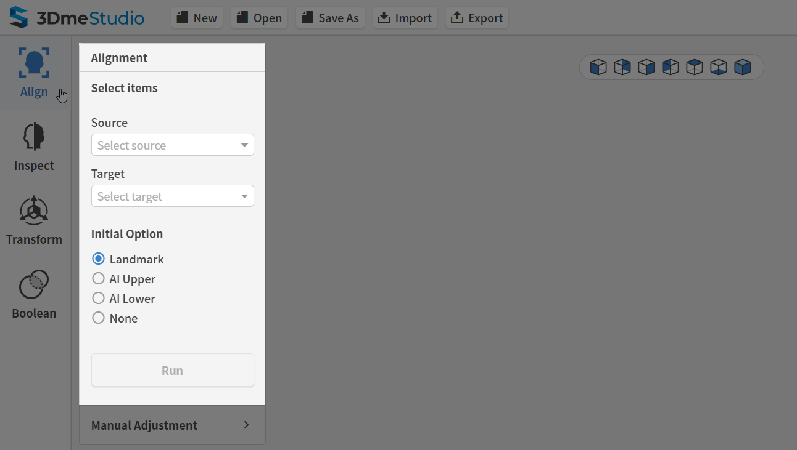

# AI based Alignment

### How to automatically align 3D dental data to CT data


AI based automated alignment between oral scan and CT (Full scan case)



AI based automated alignment between oral scan and CT (Partial scan case)​



**Quick Guide**

You can experience 3Dme Studio Tutorial - AI Alignment by downloading sample data. ​​


### Instruction

#### **Step 1**

.png>)

Press the \[Align] button on the Main menu, and start the alignment mode.​

#### **Step 2**

After setting the 3D dental scan and CT data in the Source and Target menus, respectively, select the AI mode as the Initial Option. Then, press the Run button to operate the AI-based alignment.


**Quick Guide**

The source data would be aligned to the target data. ​



Notice

If the 3D dental scan data is the **upper teeth**, select the **AI Upper** mode.\
If it is the **lower teeth**, select the **AI Lower** mode for appropriate alignment.​


